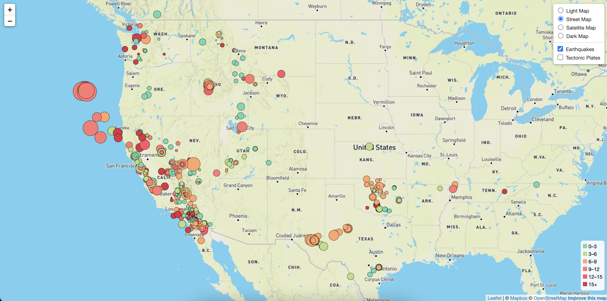
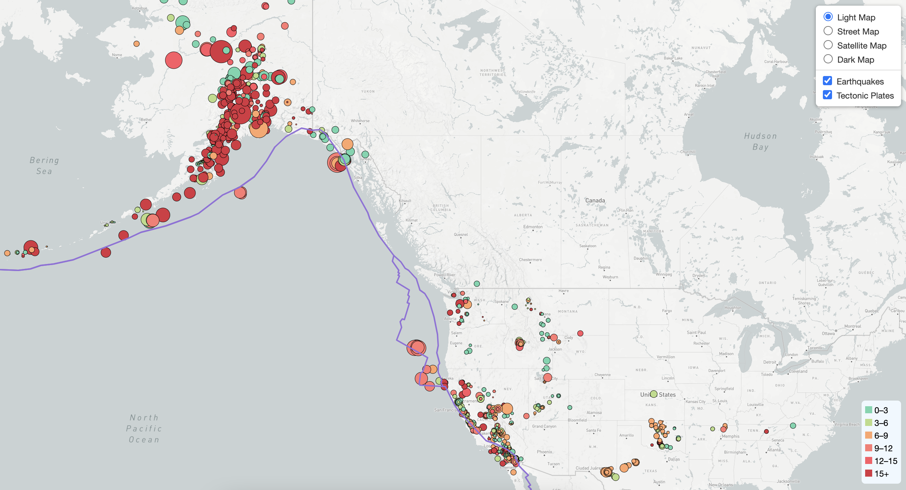
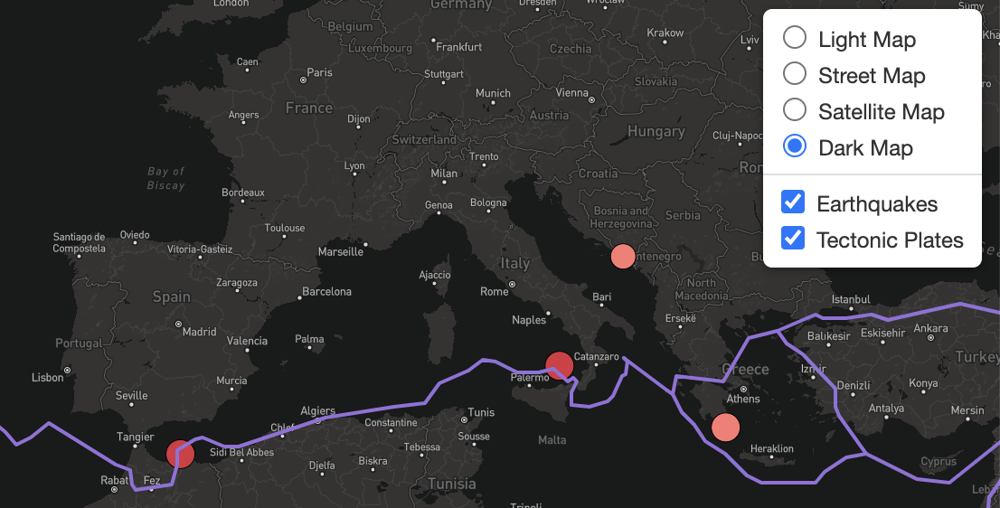
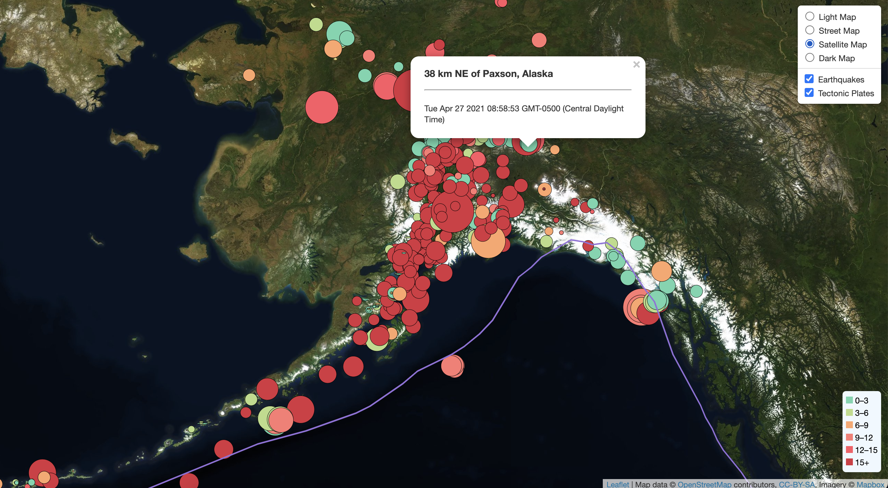

# Visualizing USGS Data with Leaflet

## Background

Welcome to the United States Geological Survey, or USGS for short! The USGS is responsible for providing scientific data about natural hazards, the health of our ecosystems and environment; and the impacts of climate and land-use change. Their scientists develop new methods and tools to supply timely, relevant, and useful information about the Earth and its processes. As a new hire, you will be helping them out with an exciting new project!

The USGS is interested in building a new set of tools that will allow them to visualize their earthquake data. They collect a massive amount of data from all over the world each day, but they lack a meaningful way of displaying it. Their hope is that being able to visualize their data will allow them to better educate the public and other government organizations (and hopefully secure more funding.) on issues facing our planet.

### Level 1: Collect Data

The first task completed was a visualization of an earthquake data set.

* The USGS provides earthquake data in a number of different formats, updated every 5 minutes at [USGS GeoJSON Feed](http://earthquake.usgs.gov/earthquakes/feed/v1.0/geojson.php).
* The dataset used for this map is called 'All Earthquakes from the Past 7 Days'. The URL of this JSON pulled in the data for the visualization.

### Level 2: Import & Visualize the Data

Leaflet was used to plot all of the earthquakes from the selected data set based on their longitude and latitude.

   * Data markers should reflect the magnitude of the earthquake by their **size** and depth of the earthquake by **color**. Earthquakes with higher magnitudes should appear larger and earthquakes with greater depth should appear darker in color.
   
   

### Level 3: Add Tectonic Plate Data

To add more context to this map a tectonic plate layers was also visualized. 

* The data was collected from a public GitHub at [https://github.com/fraxen/tectonicplates](https://raw.githubusercontent.com/fraxen/tectonicplates/master/GeoJSON/PB2002_boundaries.json).

### Level 4: Include Additional Layers

Once the data was set additional background layers were added to the map along with a control box that allows users to change background styles or select layers as 'on' or 'off'. 

### Level 5: Map details 

Once all map data was uploaded and complete, legend details were included along with pop-up for each datapoint. 
   
* Popups provide additional information about the earthquake when a marker is clicked.
* The legend provides context for your map data.

